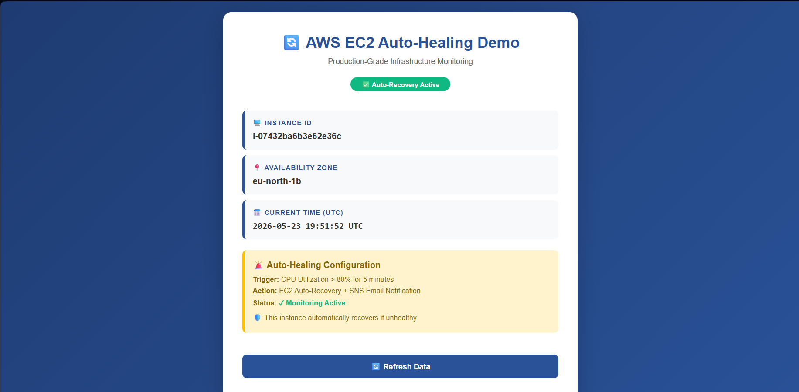
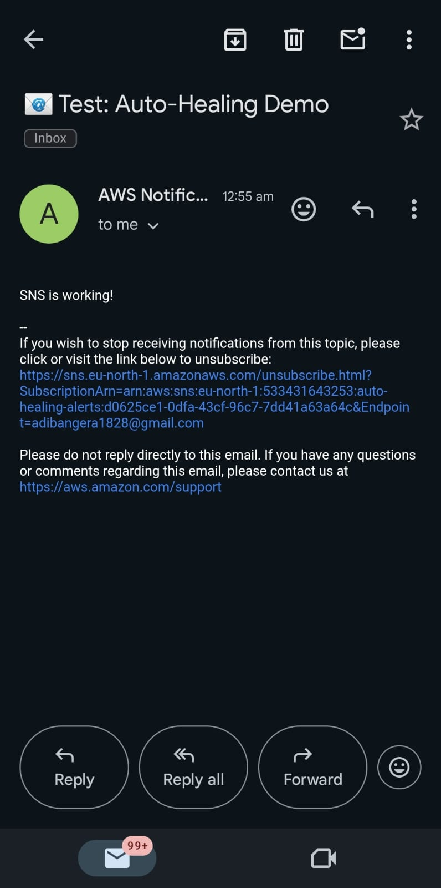

# aws-ec2-auto-healing
EC2 instance with CloudWatch auto-recovery and SNS email alerts. Part of my 25 DevOps projects journey.

# 🔄 AWS EC2 Auto-Healing Demo


## 🎯 Project Overview

A production-grade auto-healing system on AWS that automatically recovers EC2 instances when CPU exceeds 80% for 5 minutes, with real-time email notifications via SNS.

**Project #1 of my 25 DevOps Projects Journey**

## 📸 Screenshots

### Live Webpage Dashboard


### SNS Confirmation Email


### CloudWatch Alarm Email


## 🏗️ Architecture
User → Internet → EC2 (nginx) → CloudWatch Alarm → SNS → Email
↓
Auto-Recovery


## ✨ Features

- ✅ **Auto-Recovery**: Instance automatically recovers from high CPU
- ✅ **Real-time Monitoring**: CloudWatch tracks CPU utilization
- ✅ **Instant Notifications**: SNS email alerts on alarm state
- ✅ **Professional UI**: Modern dashboard with live clock
- ✅ **Zero Manual Intervention**: Fully automated recovery

## 🛠️ Tech Stack

| Category | Technologies |
|----------|--------------|
| Cloud | AWS EC2, CloudWatch, SNS, IAM |
| Web Server | Nginx on Ubuntu 24.04 |
| Monitoring | CloudWatch Alarms |
| Notifications | SNS Email Subscription |
| Frontend | HTML5, CSS3, JavaScript |
| Version Control | Git, GitHub |

## 📋 Prerequisites

- AWS account (Free tier)
- AWS CLI configured
- IAM user with EC2, CloudWatch, SNS permissions
- Basic Linux knowledge

## 🚀 Deployment Steps

### 1. Launch EC2 Instance

- **AMI**: Ubuntu 24.04 LTS
- **Type**: t3.micro (free tier)
- **Security Groups**: SSH (22), HTTP (80)

### 2. User Data Script

```bash
#!/bin/bash
apt update -y
apt install -y nginx stress
systemctl enable nginx && systemctl start nginx

# Create custom webpage
INSTANCE_ID=$(curl -s http://169.254.169.254/latest/meta-data/instance-id)
cat > /var/www/html/index.html << EOF
<!DOCTYPE html>
<html>
<head><title>Auto Healing Demo</title></head>
<body>
<h1>✅ EC2 Auto Healing Demo</h1>
<p>Instance ID: ${INSTANCE_ID}</p>
<p>Auto-recovery active: CPU > 80% for 5 minutes</p>
</body>
</html>
EOF


### 3. Create SNS Topic (Run in AWS CloudShell)

```bash
# Create SNS topic
aws sns create-topic --name auto-healing-alerts

# Subscribe your email (replace with your email)
aws sns subscribe --topic-arn "arn:aws:sns:eu-north-1:YOUR_ACCOUNT_ID:auto-healing-alerts" --protocol email --notification-endpoint "your@email.com"


### 4. Create CloudWatch Alarm

```bash
# Get your Instance ID
INSTANCE_ID=$(aws ec2 describe-instances --filters "Name=tag:Name,Values=auto-healing-demo" --query "Reservations[0].Instances[0].InstanceId" --output text)

# Get SNS ARN
SNS_ARN=$(aws sns list-topics --query "Topics[?contains(TopicArn, 'auto-healing-alerts')].TopicArn" --output text)

# Create alarm
aws cloudwatch put-metric-alarm \
    --alarm-name "auto-healing-cpu-alarm" \
    --metric-name CPUUtilization \
    --namespace AWS/EC2 \
    --statistic Average \
    --period 300 \
    --evaluation-periods 2 \
    --threshold 80 \
    --comparison-operator GreaterThanThreshold \
    --dimensions "Name=InstanceId,Value=$INSTANCE_ID" \
    --alarm-actions "$SNS_ARN"
